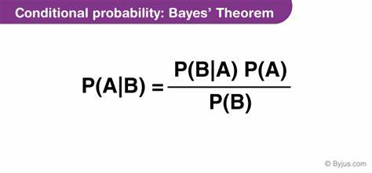

# Формула Байеса



$$
P(A|B) = 
$$

## Теория

P(A) = 0.3

P(B) = 0.25

## Вероятность гипотезы А при условии что Б наступило

P(A|B) = P(B|A) * P(A) / P(B) = 0.085 * 0.3 / 0.25 = 0.102

## Симуляция на случайных числах (1000 шт)
```
P(B|A)   = 0.085
P(~B|A)  = 0.231
P(B|~A)  = 0.181
P(~B|~A) = 0.503
```